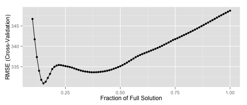

## Benefits of My App

1. Demonstrates the Accuracy Improvements of a Penalized Model
2. Shows the Effects of the Lasso Penalty on Predictor Coefficients
3. Confirms the Lasso's Ability to Remove Noise Variables from the Model
<br>
The next two slides take a look at the model preprocessing and building not visible in the App

--- .class #id 

## Look Under The Hood 1

**Load complete cases of the data and split:**

```r
hitterSal <-  Hitters[complete.cases(Hitters),19]
hitterStats <- Hitters[complete.cases(Hitters),-19] 
```

**Scale numeric variables, so $\mu=0$ and $2\sigma=1$:**

```r
integer <- sapply(hitterStats, is.integer)
scaledvars <- apply(hitterStats[,integer],2,function(x){(x-mean(x))/(2*sd(x))})
hitterStats  <- data.frame(scaledvars,hitterStats[,!integer])
```
**Add six noise variables and code dummy variables:**

```r
set.seed(5652)
hitterStats <- data.frame(hitterStats,Fake1=rnorm(263,0,0.5),Fake2=rnorm(263,0,0.5),
                          Fake3=rnorm(263,0,0.5),Fake4=rnorm(263,0,0.5), 
                          Fake5=rnorm(263,0,0.5), Fake6=rnorm(263,0,0.5))
hitterStats1  <- model.matrix(hitterSal~.-1,data=hitterStats)
```

---
## Look Under the Hood 2
**Next I trained the model, using train in the caret package:**

```r
trcontrol <- trainControl(method="cv",number=10)
lassoGrid <- expand.grid(fraction=seq(.1,1,by=0.01))
lassoTrained <- train(x=hitterStats1,y=hitterSal,method="lasso",tuneGrid=lassoGrid,trControl=trcontrol)
```
**And I plotted the results using ggplot2:**

```r
penGraph <- ggplot(lassoTrained)
penGraph
```

 

--- &radio
## Further Improvements
While I am happy with my App there are certainly additions I'd like to make. <br>
Take a guess what they are!

1. Ridge Regression Option

2. Combination of Ridge Regression and Lasso (Elastic Net)

3. An option to let the user choose the number of noise variables

4. _All of the Above_


